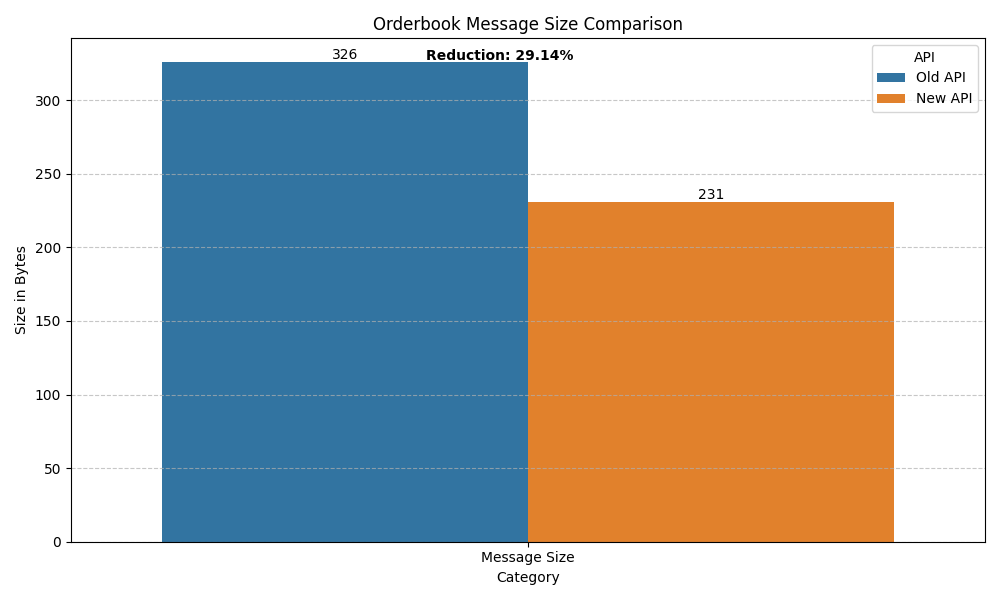

# Answering questions

## What is the difference between two APIs?

1. **Structure, message size and Format**:

   - Old API uses verbose field names (`type`, `orderType`, `quantity`, etc.) New API uses compact names (ty, ap, bp, etc.) for faster data transmission, economise resources, and reduce latency
   - New API uses Milliseconds, Old API - Microseconds
   - Old API stores bids and asks as separate records. New API combines them as pairs at each price level, reducing payload size, message count, parsing/merge work, lowers memory cost
   - New API provides totals (`tas`, `tbs`)

|                  | Old API                                  | New API                                                                                  |
| ---------------- | ---------------------------------------- | ---------------------------------------------------------------------------------------- |
| Field Names      | Verbose (`orderType`, `quantity`, etc.)  | Compact (`ap`, `bp`, `as`, `bs`, etc.). Giving up a bit of readability to reduce latency |
| Timestamp Format | Microseconds (string)                    | Milliseconds (integer, faster for computing)                                             |
| Data Strucutre   | Stores bids and asks as separate records | bid + ask pairs at each price level                                                      |

## Which API has better latency and why?

Based on the present data, the New API may have some performance spikes but overall it performs better. ~ 6% Better average latency is a key.

| Metric                  | Old API | New API | Difference               |
| ----------------------- | ------- | ------- | ------------------------ |
| Mean Latency (ms)       | 179.62  | 169.40  | -10.22 (5.69% faster)    |
| Median Latency (ms)     | 180.79  | 161.49  | -19.30 (10.68% faster)   |
| Min Latency (ms)        | 166.03  | 136.31  | -29.72 (17.90% faster)   |
| Max Latency (ms)        | 192.04  | 210.39  | +18.35 (9.56% slower)    |
| Standard Deviation (ms) | 13.04   | 37.67   | +24.63 (higher variance) |

Main reasons for this:

1. Smaller message size = less network transmission time
2. More efficient data structure
3. Probably better optimised processing on exchange side

However, the new API does show higher variance (std dev 37.67ms vs 13.04ms) and a bit bigger max latency (210.39ms vs 192.04ms).

## How can we compare both data samples?

1. **Latency Analysis**:

   - Calculate time difference between exchange timestamp and server receipt time
   - Compare statistical metrics (mean, median, min, max, standard deviation)
   - Use statistical tests (t-test, wilcoxon) to determine significance

2. **Message Efficiency**:

   - Compare message sizes and consistency
   - Analyse byte-level structure differences

The comparison below aims to see how many raw bytes each API needs to transmit one full depth level (ask + bid).
So, to keep the comparison fair, the Old API example below contains two objects, while the New API example contains one (already has ask + bid in it).

_Old API_

```json
{
  "type": "orderbookdepth",
  "content": {
    "datetime": "1732796700879952",
    "list": [
      {
        "total": "1",
        "orderType": "ask",
        "quantity": "0.0387",
        "price": "133331000",
        "symbol": "ABC_USD"
      },
      {
        "total": "2",
        "orderType": "bid",
        "quantity": "0.9006",
        "price": "133281000",
        "symbol": "ABC_USD"
      }
    ]
  },
  "recv_time": "2024-11-28 12:25:01.071989"
}
```

_New API_

```json
{
  "ty": "orderbook",
  "cd": "USD-ABC",
  "tas": 0.2823,
  "tbs": 1.1529,
  "obu": [
    {
      "ap": 133331000,
      "bp": 133281000,
      "as": 0.0387,
      "bs": 0.9006
    }
  ],
  "lv": 1,
  "tms": 1732796701204,
  "st": "REALTIME",
  "recv_time": "2024-11-28 12:25:01.414389"
}
```

- New API has a full depth level message 29.14% smaller (231 bytes vs 326 bytes). It achieves this reductions through optimisation made in point 1.

| Comparison                       | Old API | New API | Reduction |
| -------------------------------- | ------- | ------- | --------- |
| Full depth level message (bytes) | 326     | 231     | 29.14%    |

3. **Structure Analysis**:

   - Compare field naming
   - Compare data organisation (nested structure, field types)
   - Compare ease of processing/parsing data

4. **Visualisation**:
   - Box plots for latency distribution
   - Bar charts for byte size comparison

**Here are some Visualisations from reports/ folder:**





## Project Structure

```
├── analysis/          # Analysis tools (plot, print, save)
│   ├── __init__.py
│   ├── orderbook_api_analysis.py
├── api_analysers/     # Work on data samples from apis
│   ├── __init__.py
│   ├── base_api_analyser.py
│   ├── old_api_orderbook_analyser.py
│   ├── new_api_orderbook_analyser.py
├── data/
│   ├── __init__.py
│   ├── orderbook_api_samples.py
├── reports/
│   ├── orderbook_byte_size_message_comparison.csv
│   ├── orderbook_byte_size_message_comparison.png
│   ├── orderbook_latency_by_message.csv
│   ├── orderbook_latency_by_message.png
│   ├── orderbook_latency_comparison.csv
│   ├── orderbook_latency_comparison.png
├── test/
│   ├── __init__.py
│   ├── mock_samples.py
│   ├── README.md
│   ├── test_api_analyser.py
│   ├── test_api_classes.py
│   ├── test_mock_api_data.py
├── .gitignore
├── main.py    # Entry point that runs the analysis
├── requirements.txt
└── README.md
```

### Dependencies

- Python 3.12.2
- External libraries I used: numpy, pandas, seaborn, scipy. Can be installed with command below:

```bash
pip3.12 install -r requirements.txt
```

### Running the Analysis

```bash
python3.12 main.py
```

This will:

1. Process data from both API versions
2. Compare latency, message size, and data structure
3. Fill up`reports/` directory with charts and .csv files
4. Print stats to your terminal

```
=== Orderbook API Comparison Results ===

                 Metric     Old API     New API
0     Mean Latency (ms)  179.619141  169.397298
1   Median Latency (ms)  180.793213  161.495117
2      Min Latency (ms)  166.027100  136.307861
3      Max Latency (ms)  192.037109  210.388916
4  Std Dev Latency (ms)   13.044692   37.667413

=== Statistical Tests ===
Is difference statistically significant? False
Better API for latency: New API

=== Byte Size Comparison ===
Full depth level message size comparison:
  Old API: 326 bytes
  New API: 231 bytes
  Reduction: 29.14%

Reports saved to reports/ directory.
```
